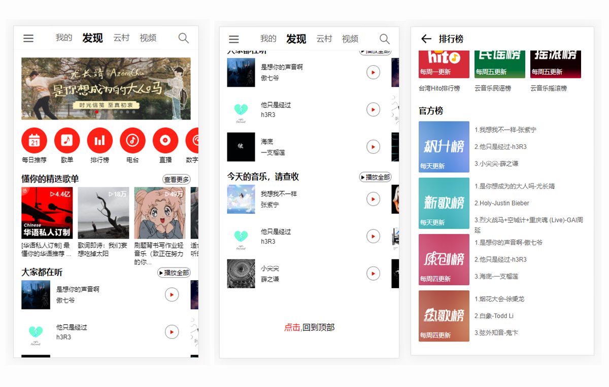
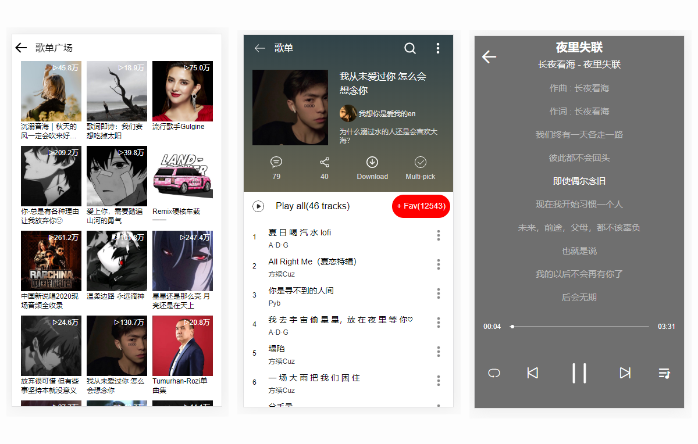
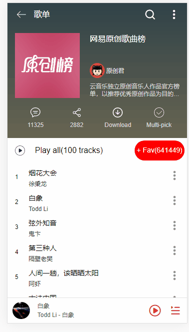

# Vue 网易云音乐 WebApp

:musical_keyboard: 基于 Vue(2.6) + vuex + vue-router + axios + vue-awesome-swiper + vant + vue-lazyload + Scss + ES6 等开发一款移动端音乐 WebApp，UI 界面参考了安卓版的网易云音乐、使用postcss响应移动端布局。

:yum: 项目演示地址：[移动端音乐 WebApp](http://139.196.203.58:8080/find) (需要开启Chrome手机调试模式)

## 预览

#### 首页、排行榜


#### 歌单广场、歌单详情、播放器


#### 热搜榜、搜索结果、搜索联想


#### 播放gif


## 开发目的

通过学习开发一个 Vue 全家桶项目，让自己更熟练的使用 Vue 全家桶、模块化开发、ES6 等等知识，提高自己的技术能力。

## 技术栈

**前端**
* `Vue`：用于构建用户界面的 MVVM 框架
* `vue-router`：为单页面应用提供的路由系统，使用了 `Lazy Loading Routes` 技术来实现异步加载优化性能
* `vuex`：Vue 集中状态管理，在多个组件共享某些状态时非常便捷
* `vue-lazyload`：实现图片懒加载，节省用户流量，优化页面加载速度
* `vant`：移动端ui组件库,使用了部分组件,如swiper,toast等
* `vue-awesome-swiper`:轮播图
* `SCSS`：css 预编译处理器
* `ES6`：ECMAScript 新一代语法，模块化、解构赋值、Promise、Class 等方法非常好用

**后端接口**
* `NeteaseCloudMusicApi`：[网易云音乐 NodeJS 版 API](https://github.com/Binaryify/NeteaseCloudMusicApi)，提供音乐数据

**其他工具**

* `vue-cli`：Vue 脚手架工具，快速初始化项目代码
* `eslint`：代码风格检查工具，帮助我们规范代码书写（一定要养成良好的代码规范）
* `prettier`: 代码自动格式化
* `iconfont` ：阿里巴巴图标库，谁用谁知道
* `postcss`：移动化响应式适配，适应移动端不同的手机宽度

## 实现功能

发现页、排行榜、歌单广场、歌单详情、搜索(热搜榜、搜索结果、搜索联想)、播放器(歌词滚动、进度条、切换音乐)等功能。

### 发现页

发现页分成五个部分，分别是banner轮播图、图标列表、推荐歌单、推荐歌曲和回到顶部，需要数据的部分都是通过axios请求API获取得到的。

轮播图： 使用了vant组件库里面的swiper组件

图标列表：从iconfont上获取需要的图标

推荐歌单： 左右滚动

推荐单曲： 使用了vue-awesome-swiper,三页轮播

### 排行榜

axios获取绑定数据，然后将数据分类，分块展示各榜单。主要是官方榜，需要通过歌单信息通过歌单的详细信息，然后拿到前三首歌曲。布局主要使用Flex布局。

### 歌单广场

与排行榜页面的实现类似，通过axios获取数据，Flex布局

### 歌单详情

这里使用到了动态路由，不同的歌单id获取不同的数据。因为在路由部分使用了keep-alive保持组件状态，需要使用activated生命周期钩子，当数据变化时，重新加载数据，更新页面。

### 搜索

搜索页面主要由上方的输入框和下方的结果两部分组成

上方的输入框：通过后端接口获取的默认输入数据，在输入的时候，会有搜索联想在下方显示，因为后端接口中没有提供这部分的功能，这里仅仅只显示了输入的内容。

下面的内容：搜索初始化页面会显示热搜榜，通过后端接口获取热搜榜数据，然后展示在搜索页面。点击热搜内容，会调转显示搜索的结果，搜索结果包含部分歌曲和歌单列表。

### 播放器

这个项目中最重要的组件，也是最难实现的部分。

主要是使用了HTML<audio>标签，用于嵌入音频文件。通过拿到audio的dom，然后调用play、pause来控制音乐的播放和暂停。它有一个属性currentTime，来显示当前的时间。

与播放器相关的数据全部放在全局state中，便于操作管理。

进度条：自己实现了一个progress组件。
大致的思路是:通过当前的时间和总的时间计算得到左边进度条的长度。点击progress组件，计算点击事件的位置，通过位置计算左边进度条的长度，然后计算出应该的时间，将这个时间emit给父组件。父组件拿到时间之后更新currentTime

歌词解析：后端提供的是一个时间+歌词的长字符串，通过正则匹配，将歌词转化为开始的时间和歌词。
基本思路：使用setTimeOut,延迟前面的时间，然后输出下一行，中间要减去代码运行的时间。

上下首切换：更改currentIndex

## TODO

1. 优化首次加载速度
2. 优化代码
3. 增加电台、视频 功能
4. 增加歌曲评论

## 感谢

- 感谢 [Binaryify](https://github.com/Binaryify) 对接口文档 [NeteaseCloudMusicApi](https://binaryify.github.io/NeteaseCloudMusicApi/#/?id=neteasecloudmusicapi) 的不断维护与更新。

## 最后

如果觉得我的项目还不错的话 :clap:，就给个 star :star: 鼓励一下吧~

## Build Setup
克隆代码到本地之后，需要运行 [NeteaseCloudMusicApi](https://binaryify.github.io/NeteaseCloudMusicApi/#/?id=neteasecloudmusicapi)，来起一个音乐的 API 接口。

如果需要在服务器上搭建的话就需要将 API 放到自己的服务器上面。

```bash
# install dependencies
npm install

# serve with hot reload at localhost:8080
npm run serve

# build for production with minification
npm run build
```


